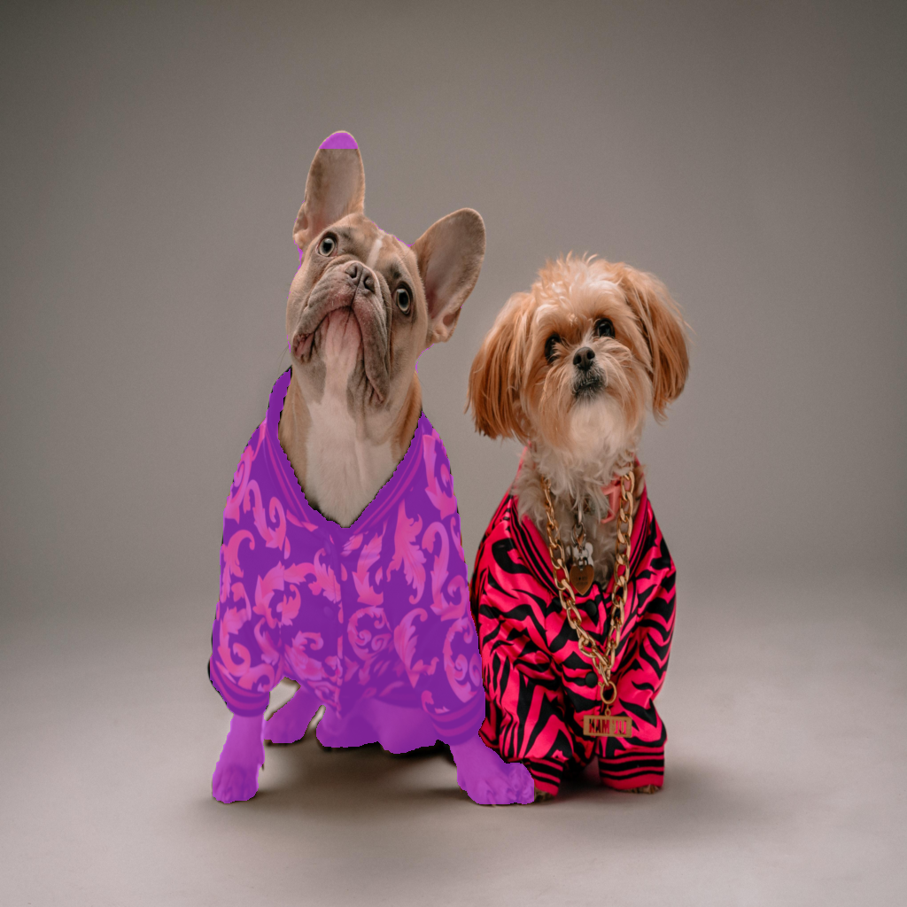

# Prompting for Segmentation

## Introduction

We implement a module for segmenting images using (points and bounding box) prompts, in PyTorch. As a model, we use pretrained [FastSAM](https://arxiv.org/abs/2306.12156) provided by [ultralytics](https://docs.ultralytics.com/models/fast-sam/). 

## Prompts

### Point prompts

#### Using single prompt

~~~
python3 segment.py dogs.jpg 400,400 --label_prompts 1 --image_size 1024 1024
~~~

  
  
  

#### Using multiple prompts

~~~
python3 segment.py dogs.jpg 400,400 700,400 --label_prompts 0 1 --image_size 1024 1024
~~~

  
  
  

### Bounding box prompts

#### Using single prompt

~~~
python3 segment.py dogs.jpg 625,625,700,700 --label_prompts 1 --image_size 1024 1024
~~~

  
  
  

#### Using multiple prompts

~~~
python3 segment.py dogs.jpg 500,200,800,900 510,210,810,610 --label_prompts 1 0 --image_size 1024 1024
~~~

  
  
  

